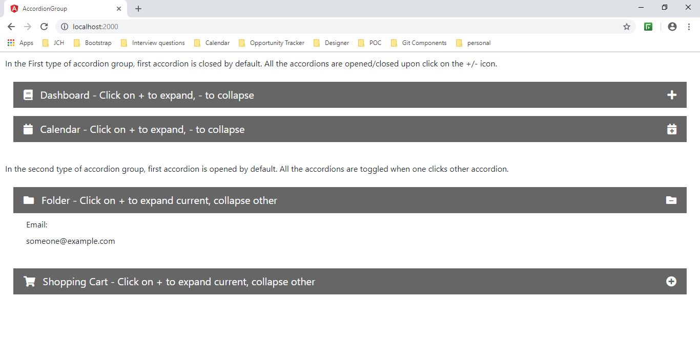
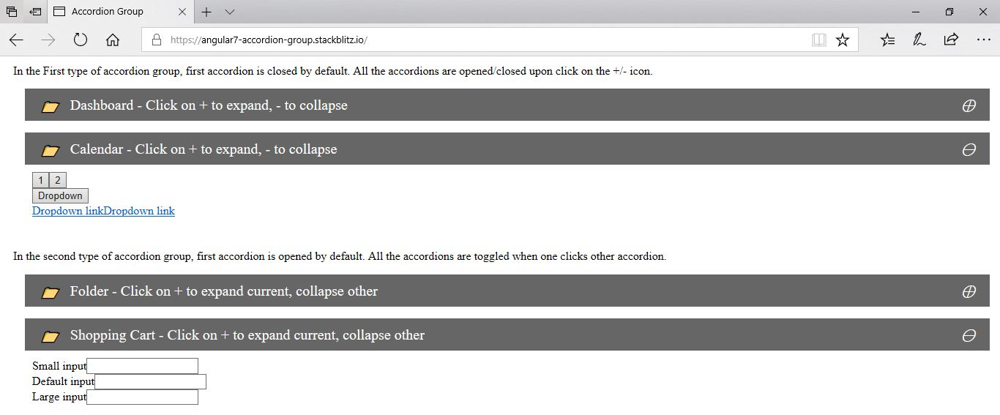
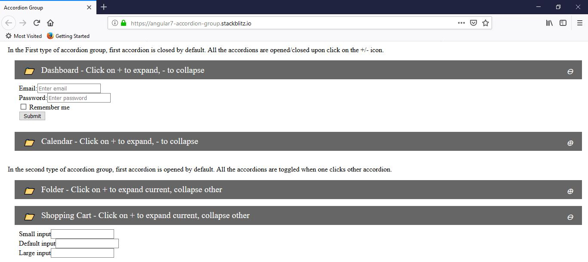
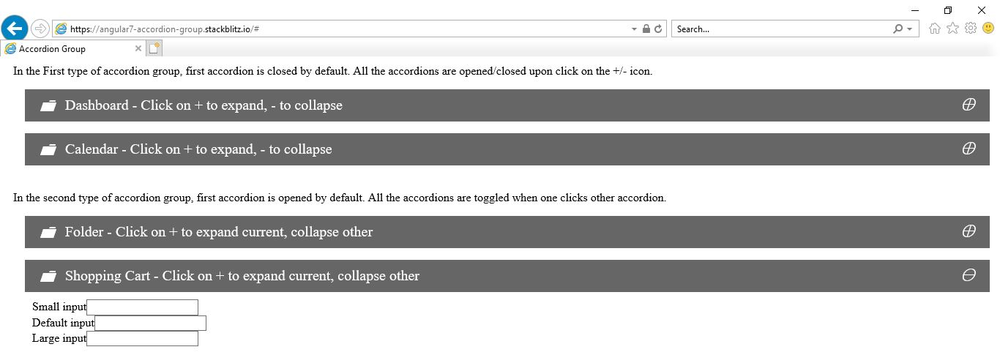
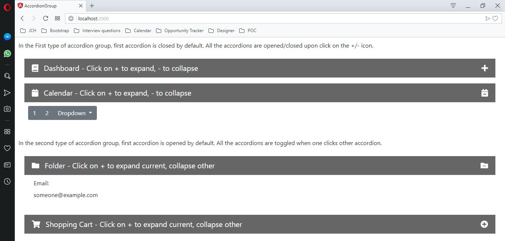

# AccordionGroup

Accordion Group created using Font-Awesome, Bootstrap and Angular 7 to provide collapsible panel utility across different browsers without using any built in utility like jquery.







## Demo

Checkout the demo on StackBlitz - https://angular7-accordion-group.stackblitz.io/

## Adding the component in your project

### Add Components in module
Import
`
import { AccordionGroupComponent } from './components/accordion/accordion-group.component';
import { AccordionComponent } from './components/accordion/accordion.component';
`

Declaration
`
declarations: [
     AccordionGroupComponent,
    AccordionComponent
  ]
`

### Add selector in HTML
```
<app-accordion [openFirst]="openFirst1" [toggle]="toggle1">
 <app-group [title]="title1" [description]="description1" [icon]="icon1" [open]="open1" [close]="close1">
 // form content
 </app-group>
 </app-accordion>
```
### Selector Properties
Property `openFirst`, `toggle` accept boolean values.
Property `title`, `description`, `icon`,`open` and `close` accept string values.

### accordion.component.ts
``` typescript
import { Component, ContentChildren, QueryList, AfterContentInit, Input, OnInit } from '@angular/core';
import { AccordionGroupComponent } from './accordion-group.component';

@Component({
  selector: 'app-accordion',
  templateUrl: 'accordion.component.html',
  styleUrls: ['./accordion.component.css']
})

export class AccordionComponent  implements OnInit, AfterContentInit {
  @ContentChildren(AccordionGroupComponent)
  groups: QueryList<AccordionGroupComponent>;

  @Input() title: any;

  @Input() icon: any;

  @Input() openFirst: boolean;

  @Input() toggle: boolean;

  ngOnInit() {
  }
  /**
   * Invoked when all children (groups) are ready
   */
  ngAfterContentInit() {
    // Set active to first element
    if (this.openFirst) {
      this.groups.toArray()[0].opened = true;
    }
    // Loop through all Groups
    this.groups.toArray().forEach((t) => {
      // when title bar is clicked
      // (toggle is an @output event of Group)
      t.toggle.subscribe(() => {
        // Open the group
        this.openGroup(t);
      });
    });
  }

  /**
   * Open an accordion group
   * @param group   Group instance
   */
  openGroup(group) {
    if (this.toggle) {
      // close other groups
      this.groups.toArray().forEach((t) => {
        if (t !== group) {
        t.opened = false;
        }
      });
    }
    // open current group
    group.opened = !group.opened;
  }
}

```

### accordion.component.html
``` html
<ng-content></ng-content>
```

### accordion.component.css
``` css
 .accordionPanel {
     margin:1em;
 }
  .accordionPanel .titleBar {
    background-color: rgba(102, 102, 102, 1);
    color:white;
    width: 100%;
    padding: 10px;
    cursor: pointer;
    border-bottom: 1px solid #666;
  }

  .accordionPanel .title {
      margin:5px;
      font-size:20px;
  }
  
  .accordionPanel .body {
    padding: 10px;
  }
  
  .accordionPanel .body.hidden {
    display: none;
  }

  .expandCollapseIcon {
      float:right;
      font-size:20px;
      margin: 0px 10px;  
  }

  .headerIcon {
      float:left;
      font-size:20px;
      margin:0px 10px;
  }

  .open::after {
    content: "\2295";
  }

  .close::after {
    content: "\2296";
  }

  .icon::after {
    content: "\1F4C1";
  }
```
### accordion-group.component.ts
``` typescript
import { Component, Input, Output, EventEmitter, OnInit } from '@angular/core';

@Component({
  selector: 'app-group',
  templateUrl: 'accordion-group.component.html',
  styleUrls: ['accordion.component.css']
})
export class AccordionGroupComponent implements OnInit{

  /**
   * If the panel is opened or closed
   */
  @Input() opened = false;

  /**
   * Text to display in the group title bar
   */
  @Input() title: string;

  @Input() description; string;

  @Input() icon: string;

  @Input() open: any;

  @Input() close: any;
  /**
   * Emitted when user clicks on group titlebar
   */
  @Output() toggle: EventEmitter<any> = new EventEmitter<any>();

  ngOnInit() {
    if (!this.open) {
      this.open = 'open';
    }
    if (!this.close) {
      this.close = 'close';
    }
    if (!this.icon) {
      this.icon = 'icon';
    }
  }
}


```
### accordion-group.component.html

``` html
<div class="accordionPanel">
    <div class="titleBar" (click)="toggle.emit()">
    <span class="headerIcon"><i [ngClass]="[icon]"></i></span>
    <span class="title">{{title}} - {{description}}</span>
    <span class="expandCollapseIcon"><i [ngClass]="opened?[close]:[open]"></i></span>
    </div>
    <div class="body" [ngClass]="{'hidden': !opened}">
      <ng-content></ng-content>
    </div>
  <div>

```
## Author

parasmani.jain2208@gmail.com

